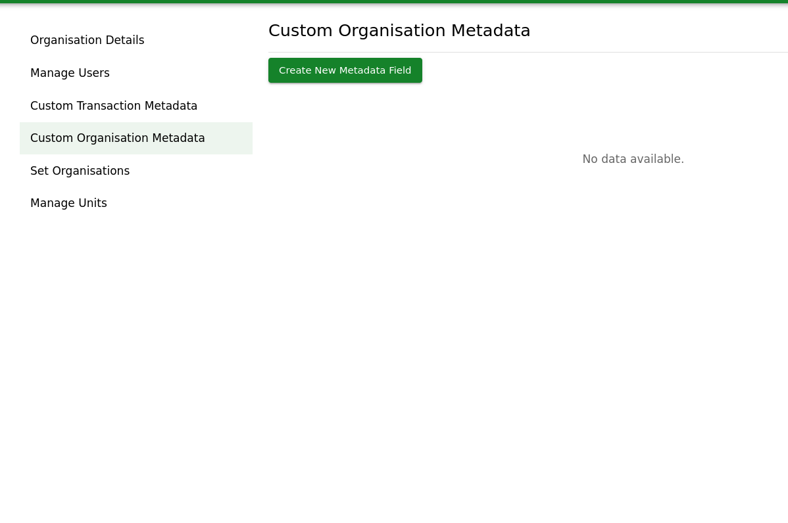
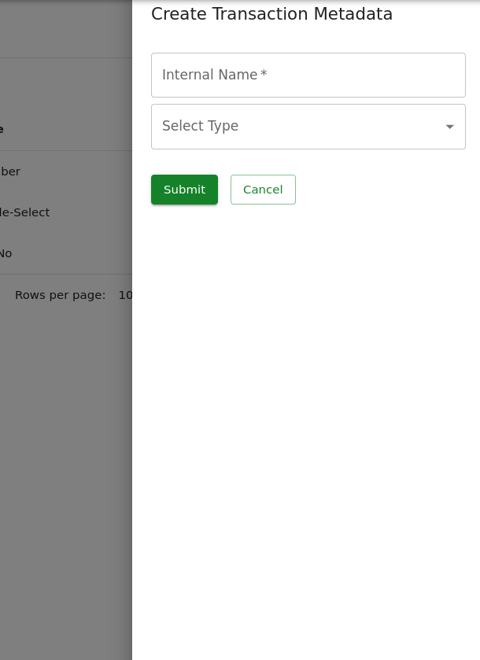
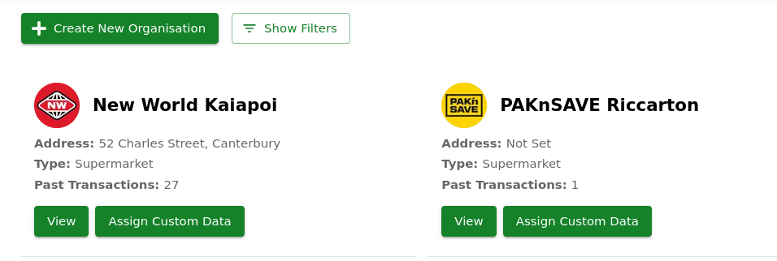
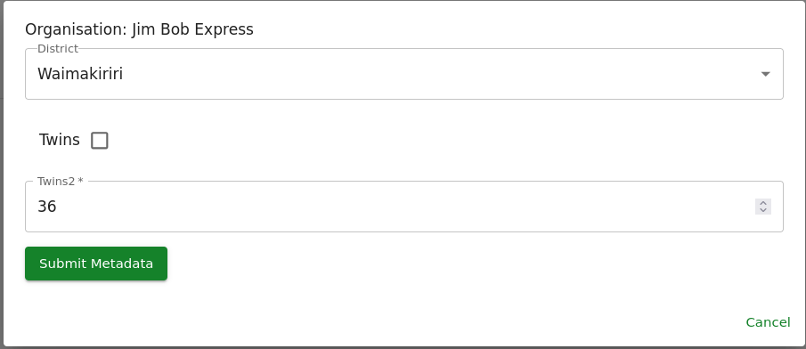

# Organisation Metadata

Well what is Organisation Metadata? These are numbers, dropdowns or checkboxes that you can add to Organisations to record data that the base platform doesn't allow you to track otherwise.

A few examples of ways this is used:

* Which district is this organisation from?
* What year did we start receiving food from this supermarket?
* This organisation is a part of a bigger group of organisations (e.g. A branch of a chain)

## Types of Organisation Metadata

* Yes/No - This is a checkbox which you can set as Yes or No

* Single-Select - This is a list of options; each organisation can have one (or none) of the options selected.

* Number - This is a positive number that can represent any quantity or other number.

## Creating Organisation Metadata

To create new Organisation Metadata Fields is an easy process.

1. Make your way to the "Hub Settings" page in the main menu or via this link: [https://data.afra.org.nz/your-hub](https://data.afra.org.nz/your-hub)

2. Navigate to the "Custom Organisation Metadata" Tab

3. On this page, any existing metadata fields will be listed.

4. Click on the, "Create New Metadata Field" button

A side drawer will open

5. Select which "Type" of Metadata you want & Type a name that will appear on the Form when applying these fields.

6. Click the "Submit" button.

## Entering Custom Metadata on an Organisation.

1. Navigate to the Organisation Page. Either via the main menu or [this link](https://data.afra.org.nz/organisations).

2. Either choose an existing organisation, or create a new one [How to create a new organisation](/data-platform/organisations/creating-organisations)

3. If you have Custom Metadata created, a new button will appear on **every** organisation.

4. When clicking, "Assign Custom Data", a window will pop up.

In this example, there are 3 custom organisation metadata fields.

> 1. District? (Single-Select)
> 2. Twins? (Yes/No)
> 3. Twins 2? (Number)

All fields are **optional**
