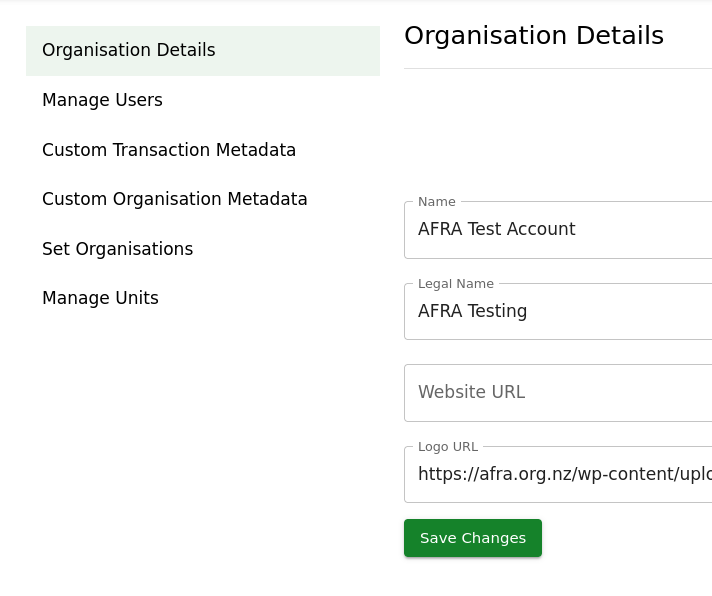

# Transaction Metadata

Well what is Transaction Metadata? These are numbers, dropdowns or checkboxes that you can add to the Transaction Form to record data that the base platform doesn't allow you to track otherwise.

A few examples of ways this is used:

* How many meals were served today?
* How many food parcels did this volume of food represent?
* Was this food from NZFN? (yes/no)

## Types of Transaction Metadata

* Yes/No - This is a checkbox which you can set as Yes or No

* Single-Select - This is a list of options; each transaction can have one (or none) of the options selected.

* Number - This is a positive number that can represent any quantity or other number.

## Creating Transaction Metadata

To create new Transaction Metadata Fields is an easy process.

1. Make your way to the "Hub Settings" page in the main menu or via this link: [https://data.afra.org.nz/your-hub](https://data.afra.org.nz/your-hub)

2. Navigate to the "Custom Transaction Metadata" Tab

3. On this page, any existing metadata fields will be listed.

4. Click on the, "Create new Transaction Metadata" button

A side drawer will open

5. Select which "Type" of Metadata you want & Type a name that will appear on the Transaction Form

6. Click the "Submit" button.

## Entering Custom Metadata on the Transaction Form

1. Create a new Transaction via the Transactions Page. [Documentation on that is available here](/data-platform/transactions/entering_transactions)

2. If you have Custom Metadata created, these will appear on **every** transaction form.

In this example, there are 3 custom transaction metadata fields.

> 1. How many Households attended the Freestore today? (Number)
> 2. Is this School or Business? (Single-Select)
> 3. Test Variable (Yes/No)

All fields are **optional**

3. If this transaction requires data, then fill in those fields.

In this case, I am rescuing food from my local New World.

> 1. How many Households attended the Freestore today? (Number)

This will be left blank as this is not applicable

> 2. Is this School or Business? (Single-Select)

This is a Business, so I selected Business.

> 3. Test Variable (Yes/No)

In this case, this is true, so I selected "Yes"

