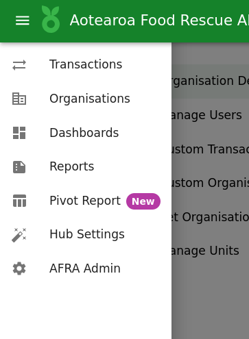
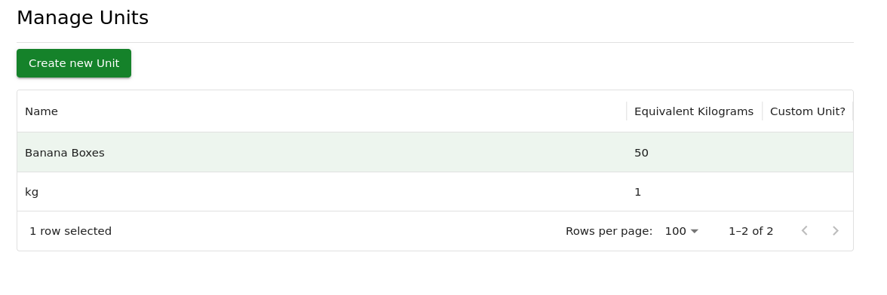

# Creating Custom Units

🥭 Some members have historically used alternative units, most commonly:

* Banana Boxes, often estimated at 10–15 kg per box
* Other containers or local measures specific to their workflows

The AFRA Data Platform supports these units by allowing each one to be configured with a specific kilogram equivalent. For example:

| Unit          | Multiplier (kg)     |
|---------------|---------------------|
| Banana Box    | 13 kg               |
| Crate         | 10 kg               |
| Custom Unit   | Set by org admin    |

## How to create a custom unit

To create new Custom Units is an easy process.

1. Make your way to the "Hub Settings" page in the main menu or via this link: [https://data.afra.org.nz/your-hub](https://data.afra.org.nz/your-hub)

2. Navigate to the "Manage Units" Tab

3. Existing Units (such as the **default** 1kg measure) will be listed.

4. To create a new unit, click the "Create new unit" button

5. Fill in the form

* Unit Name: *The name you want this known by, will appear in the Unit dropdown of each item of the Transaction Form*
* Equivalent Kilograms: *The equiavelent weight in kilograms*

Press the "Create Unit" button.