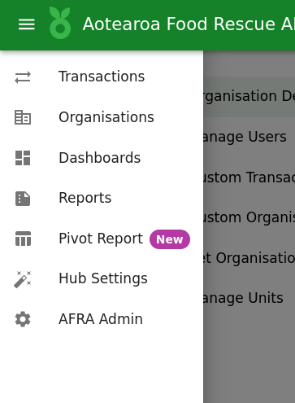
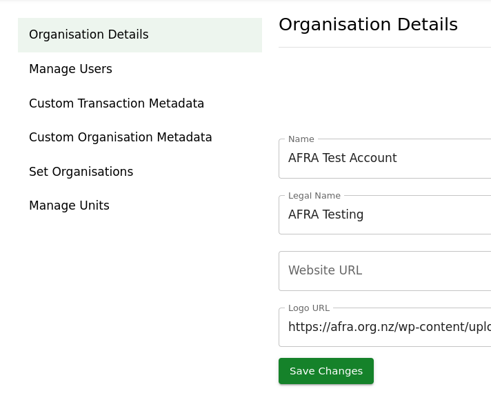
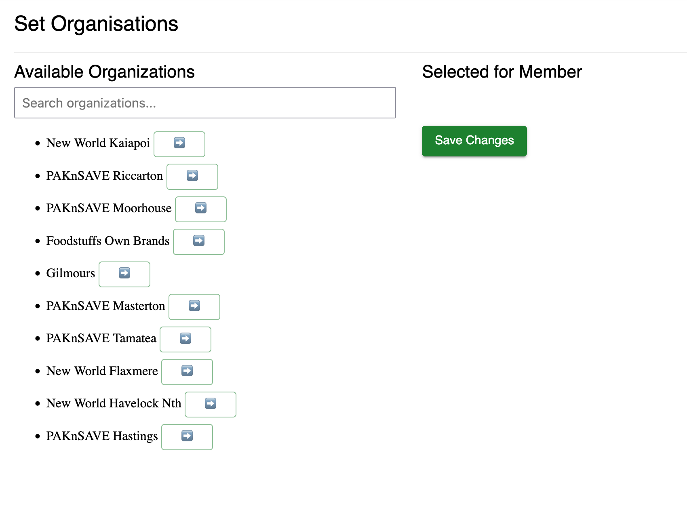

# Limit Organisation List

You can now limit the list of organisations' 

This page is made up of two lists.

The list on the left is *searchable* and contains **all** organisations on the platform that are not selected.

The list on the right are those that will show up in the transaction form in the dropdown.

Any other area of the platform will <u>**not**</u> be restricted.

## Steps to create your list

1. Make your way to the "Hub Settings" page in the main menu or via this link: [https://data.afra.org.nz/your-hub](https://data.afra.org.nz/your-hub)

2. Navigate to the "Set Organisations" Tab

3. Select any organisations that you wish to set, click the arrow button to move those to the Selected list.

4. Save changes when you've made your selection.
