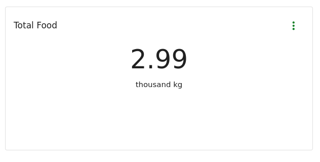

# Widgets

Widgets are the boxes on dashboard. They display your transaction data in various formats.

Widgets have several consistent features

* A title
* An (optional) description
* Some display of data [See widget types below](#widget-types)
* A menu with several options
    * Fullscreen
    * Edit - Coming Soon!
    * Download - Downloads the underlying data to CSV

## Widget Types

There are currently 4 widget types

1. Number
2. Bar Chart
3. Pie Chart
4. LineChart

We will be introducing in time other types such as,
* Tables
* PivotTables
* Maps
* Infographics